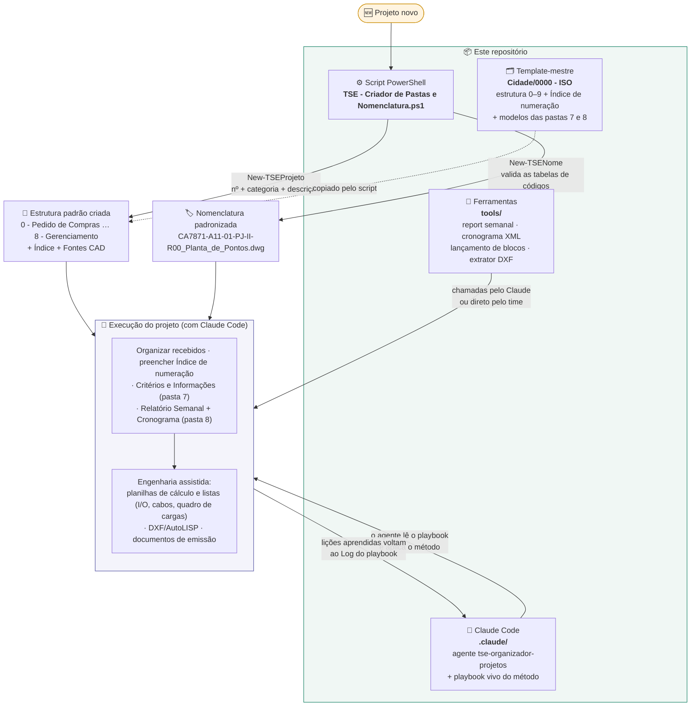

# TSE — Método de Projetos de Elétrica e Automação

Repositório **privado do grupo TSE Energia e Automação** que centraliza o método de organização e execução de projetos de elétrica/automação — do primeiro dia (criar as pastas e dar nome aos arquivos) à execução assistida por IA (Claude Code) com ferramentas de automação de CAD e gestão.

O método foi validado em projeto real e evolui a cada projeto: as lições aprendidas voltam para o **playbook vivo** versionado aqui.

---

## Mapa do repositório

| Caminho | O que é |
|---|---|
| `TSE - Criador de Pastas e Nomenclatura.ps1` | Script PowerShell: cria a estrutura padrão de pastas do projeto e monta nomes de arquivo no padrão TSE (`CLIENTE+PROJETO-ÁREA-NN-TIPO-CONTEÚDO-Rxx_Descrição.ext`) |
| `Cidade\0000 - ISO\` | **Template-mestre** de projeto: estrutura 0–9 vazia + `Indice de detalhamento e numeração.xlsx` + `TAMANHOS DE FONTES PARA CAD.jpeg` + modelos das pastas 7 e 8 (inclui `8 - Gerenciamento do Projeto\Semanal\` com o Relatório Semanal S00 em branco) |
| `.claude\agents\tse-organizador-projetos.md` | Agente do Claude Code que aplica o método de organização de projetos |
| `.claude\tse-playbook-organizacao.md` | **Playbook vivo (autoaprendente)** do método — fases, receitas e o Log de aprendizado |
| `tools\` | Ferramentas genéricas de automação (Python + AutoLISP), com README próprio |
| `tools\novo_report_semanal.py` | Gera o próximo Relatório Semanal (Excel COM) copiando o anterior |
| `tools\cronograma_msproject.py` | Cria/atualiza cronogramas em XML do MS Project (listar, set, marcos, nova revisão) |
| `tools\tse_lanca_blocos.lsp` | Lançamento em lote de símbolos no AutoCAD (compatível com blocos inteligentes do ProElétrica) |
| `tools\extrai_blocos_dxf.py` | Extrai símbolos limpos de uma legenda/biblioteca DXF (ezdxf) |
| `LICENSE` | Licença MIT |

---

## Como tudo se conecta



**Em resumo:** o script cria a casa e dá nome aos arquivos; o template garante que toda casa nasce igual; o agente + playbook fazem o Claude Code trabalhar do jeito TSE dentro dela; as ferramentas de `tools/` executam as partes repetitivas (relatório, cronograma, CAD); e cada projeto realimenta o playbook — o método aprende.

---

## Como usar cada parte

### 1) Script PowerShell — pastas + nomenclatura

No PowerShell, dentro da pasta onde está o `.ps1`:

```powershell
# 1) Menu interativo
.\"TSE - Criador de Pastas e Nomenclatura.ps1"

# 2) Só carregar as funções (dot-source) e chamar direto
. .\"TSE - Criador de Pastas e Nomenclatura.ps1"

New-TSEProjeto -Numero 8044 -Categoria PROJ -Descricao "TERMINAL PORTUARIO COFCO"

New-TSENome -Cliente CO -Projeto 8044 -Area A10 -Doc 1 `
            -Tipo MC -Conteudo SG -Rev 0 `
            -Descricao "Memorial de Calculo Guarda-Corpo" -Extensao docx
# -> CO8044-A10-01-MC-SG-R00_Memorial_de_Calculo_Guarda-Corpo.docx
```

Se o PowerShell bloquear a execução, rode uma vez:

```powershell
Set-ExecutionPolicy -Scope Process -ExecutionPolicy Bypass
```

**Antes do primeiro uso**, ajuste as duas variáveis no topo do `.ps1`:

```powershell
$RaizProjetos = "C:\...\Pasta-onde-os-projetos-serao-criados"
$PastaModelo  = "C:\...\Pasta-com-Indice.xlsx-e-Fontes-CAD.jpeg"
```

Sugestão: aponte `$PastaModelo` para a pasta `Cidade\0000 - ISO\` deste repositório.

<details>
<summary>Detalhe: menu do script</summary>

```
MENU:  1) Criar estrutura de pastas  →  New-TSEProjeto  (nº, categoria, descrição → pastas 0–8 + modelos)
       2) Gerar nome de arquivo      →  New-TSENome     (cliente, projeto, área, doc, tipo, conteúdo, rev → nome validado)
       3) Ver tabelas de códigos     →  Show-TSETabela  (CLIENTE / AREA / TIPO / CONTEUDO)
       0) Sair
```
</details>

### 2) Agente + playbook — trabalhar com o Claude Code

Abra o **Claude Code** na raiz deste repositório (ou de um projeto que o referencie) e acione o agente `tse-organizador-projetos`. O agente lê o playbook (`.claude\tse-playbook-organizacao.md`) e conduz o projeto pelo método TSE. Seções atuais do playbook:

- **0–7. O núcleo do método**: princípios → fase ENTENDER (escopo) → ESTRUTURA (pastas) → ORGANIZAR (recebidos) → NOMENCLATURA + Índice → pastas 7 e 8 → EXTRAIR informações → entregáveis terminais.
- **8. Relatório Semanal** — as 7 abas, mapeamento de células, cópia do report anterior via Excel COM, % global.
- **9. Cronograma MS Project XML** — estrutura Task/Resources/Assignments, fases com marcos, ciclo de revisões R(n)→R(n+1).
- **10. Narrativa de emissão** — notas padrão de desenho/planilha, versão cliente × interna, ciclo R00 preliminar → as-built.
- **11. Entregáveis por template** — copiar planilha-exemplo preservando fórmulas e base NBR 5410, com verificação independente em Python obrigatória.
- **12. Automação CAD e ProElétrica** — arquitetura "Python cérebro + LISP mão", regra de ouro dos blocos inteligentes, método âncoras→overlay, gotchas de DXF.
- **Log de aprendizado** — cada projeto executado acrescenta lições datadas. **O playbook é autoaprendente: mantenha o Log atualizado ao trabalhar.**

### 3) Ferramentas — `tools/`

Guia completo em [`tools/README.md`](tools/README.md). Uma linha de cada:

```bat
:: Próximo Relatório Semanal (copia o anterior e preenche semana/status/% via Excel COM)
python tools\novo_report_semanal.py --pasta "C:\...\8 - Gerenciamento do Projeto\Semanal"

:: Cronograma MS Project XML (também: set | add-marco | nova-revisao)
python tools\cronograma_msproject.py listar --arquivo Cronograma_R01.xml

:: Símbolos limpos a partir de uma legenda DXF
python tools\extrai_blocos_dxf.py --lib legenda.dxf --out simbolos_limpos.dxf

:: No AutoCAD: APPLOAD -> tse_lanca_blocos.lsp -> comando TSELANCA
:: (replica um símbolo-fonte em todos os pontos da lista *TSE_PTS* gerada por Python)
```

---

## Requisitos

| Parte | Requisito |
|---|---|
| Script de pastas/nomenclatura | Windows PowerShell 5+ |
| `novo_report_semanal.py` | Python 3.11+ com `pywin32` + **Excel instalado** (edição via COM) |
| `cronograma_msproject.py` | Python 3.11+ (gera XML puro; abrir no MS Project) |
| `extrai_blocos_dxf.py` | Python 3.11+ com `ezdxf` |
| `tse_lanca_blocos.lsp` | AutoCAD completo (com o plugin do símbolo carregado, ex.: ProElétrica) |
| Agente + playbook | Claude Code |

```bat
pip install ezdxf pywin32
```

---

## Regra de dados — leia antes de commitar

**Dados de cliente NUNCA entram neste repositório.** Nada de propostas, valores, contatos, P&IDs, listas de tags reais, contagens de I/O de projeto, DWGs/planilhas de cliente. O que entra aqui é só o **método**: templates em branco, ferramentas genéricas, exemplos fictícios ou anonimizados e as lições do playbook (escritas de forma genérica). Os arquivos do projeto vivem na pasta do projeto, fora do repo.

---

## Padrão de nomenclatura

```
CLIENTE + PROJETO - AREA - NN - TIPO - CONTEUDO - Rxx _ Descrição . ext
   CA      7871     A11   01    PJ      II        R00   Planta_de_Pontos  dwg
```

Campos:

| Campo     | Exemplo | Origem                                        |
|-----------|---------|-----------------------------------------------|
| Cliente   | `CA`    | Tabela `$CLIENTE` (2 letras)                  |
| Projeto   | `7871`  | Nº interno TSE                                |
| Área      | `A11`   | Tabela `$AREA` (`Axx`)                        |
| Doc       | `01`    | Nº do documento dentro da área (2 dígitos)    |
| Tipo      | `PJ`    | Tabela `$TIPO` (2 letras)                     |
| Conteúdo  | `II`    | Tabela `$CONTEUDO` (2 letras)                 |
| Revisão   | `R00`   | `R` + 2 dígitos (0 = emissão inicial)         |
| Descrição | texto   | Espaços viram `_`                             |
| Extensão  | `dwg`   | docx / pdf / dwg / xlsx ... (opcional)        |

As tabelas de códigos vivem dentro do próprio `.ps1` e podem ser editadas — basta acrescentar novas linhas nos hashtables `$CLIENTE`, `$AREA`, `$TIPO`, `$CONTEUDO`.

---

## Estrutura de pastas criada

```
NÚMERO - CATEGORIA DESCRIÇÃO\
├── 0 - Pedido de Compras
├── 1 - Recebidos
├── 2 - Fotos
├── 3 - ART
├── 4 - Editáveis
├── 5 - Vínculos
├── 6 - PDF's
├── 7 - Informações do Projeto
├── 8 - Gerenciamento do Projeto
├── Indice de detalhamento e numeração.xlsx
└── TAMANHOS DE FONTES PARA CAD.jpeg
```

O template-mestre em `Cidade\0000 - ISO\` traz também a subpasta `9 - Boletim de Medição` e a estrutura `8 - Gerenciamento do Projeto\Semanal\` com o `XXXX-Relatório Semanal-S00.xlsx` em branco.

---

## Licença

[MIT](LICENSE).
