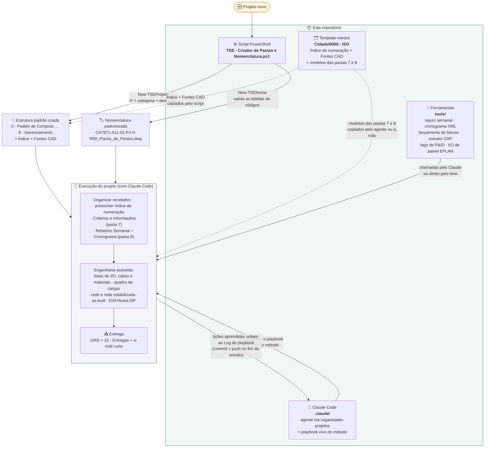

# TSE — Método de Projetos de Elétrica e Automação

Repositório **privado do grupo TSE Energia e Automação** que centraliza o método de organização e execução de projetos de elétrica/automação — do primeiro dia (criar as pastas e dar nome aos arquivos) à execução assistida por IA (Claude Code) com ferramentas de automação de CAD, leitura de documentos e gestão.

O método foi validado em projeto real e evolui a cada projeto: as lições aprendidas voltam para o **playbook vivo** versionado aqui.

> **Última atualização deste README: 07/10/2026.** O Log de aprendizado do playbook é sempre mais atual que este arquivo.

---

## Por onde começar

| Quero... | Vá para |
|---|---|
| Criar a estrutura de um projeto novo e dar nome aos arquivos | [1. Script de pastas e nomenclatura](#1-script-de-pastas-e-nomenclatura) |
| Organizar e documentar um projeto com o Claude Code | [2. Agente e playbook](#2-agente-e-playbook-claude-code) |
| Gerar relatório semanal ou cronograma, lançar símbolos no CAD | [3. Ferramentas](#3-ferramentas-tools) |
| Tirar tags de um P&ID vetorizado ou a configuração de I/O de um painel EPLAN | [3. Ferramentas](#3-ferramentas-tools) |
| Saber o que não pode errar | [Regras firmes do método](#regras-firmes-do-método) |
| Saber se o método já cobre a minha situação | [O que o método já cobre](#o-que-o-método-já-cobre) |
| Registrar uma lição aprendida | [Como contribuir com o método](#como-contribuir-com-o-método) |

Para ter o repositório na sua máquina (é privado — precisa de acesso à organização `lumen-verum` no GitHub):

```bash
git clone https://github.com/lumen-verum/TSE---Criador-de-Pastas-e-Nomenclatura.git
```

---

## Mapa do repositório

| Caminho | O que é |
|---|---|
| `TSE - Criador de Pastas e Nomenclatura.ps1` | Script PowerShell: cria a estrutura padrão de pastas do projeto e monta nomes de arquivo no padrão TSE (`CLIENTE+PROJETO-ÁREA-NN-TIPO-CONTEÚDO-Rxx_Descrição.ext`) |
| `Cidade\0000 - ISO\` | **Template-mestre** de projeto: `Indice de detalhamento e numeração.xlsx`, `TAMANHOS DE FONTES PARA CAD.jpeg` e os modelos em branco das pastas 7 (Critérios e Informações do Projeto) e 8 (Relatório Semanal S00). O git não guarda pasta vazia — as pastas 0–6 não vêm no clone; quem as cria é o script |
| `.claude\agents\tse-organizador-projetos.md` | Agente do Claude Code que aplica o método de organização de projetos |
| `.claude\tse-playbook-organizacao.md` | **Playbook vivo (autoaprendente)** do método — princípios, fases, receitas e o Log de aprendizado |
| `tools\` | Ferramentas genéricas de automação (Python + AutoLISP), com [README próprio](tools/README.md) |
| `tools\novo_report_semanal.py` | Gera o próximo Relatório Semanal (Excel COM) copiando o anterior |
| `tools\cronograma_msproject.py` | Cria/atualiza cronogramas em XML do MS Project (listar, set, marcos, nova revisão) |
| `tools\tse_lanca_blocos.lsp` | Lançamento em lote de símbolos no AutoCAD (compatível com blocos inteligentes do ProElétrica) |
| `tools\extrai_blocos_dxf.py` | Extrai símbolos limpos de uma legenda/biblioteca DXF (ezdxf) |
| `tools\pid_extrai_tags.py` | Extrai as tags dos balões de instrumento de um P&ID em PDF com **texto vetorizado** (sem OCR), separando escopo novo × existente pela nuvem de revisão |
| `tools\eplan_extrai_io.py` | Levanta rack, slot, cartão, designação do módulo e régua de bornes do **PDF de fabricação do EPLAN**, com conferência cruzada pelos bornes |
| `LICENSE` | Licença MIT |

---

## Como tudo se conecta



**Em resumo:** o script cria a casa e dá nome aos arquivos; o template garante que toda casa nasce igual; o agente + playbook fazem o Claude Code trabalhar do jeito TSE dentro dela; as ferramentas de `tools/` executam as partes repetitivas (relatório, cronograma, CAD, leitura de P&ID e de desenho de painel); e cada projeto realimenta o playbook — o método aprende.

---

## Como usar cada parte

### 1. Script de pastas e nomenclatura

No PowerShell, dentro da pasta onde está o `.ps1`:

```powershell
# 1) Menu interativo
.\"TSE - Criador de Pastas e Nomenclatura.ps1"

# 2) Só carregar as funções (dot-source) e chamar direto
. .\"TSE - Criador de Pastas e Nomenclatura.ps1"

New-TSEProjeto -Numero 8044 -Categoria PROJ -Descricao "TERMINAL PORTUARIO COFCO"

New-TSENome -Cliente CO -Projeto 8044 -Area A10 -Doc 1 `
            -Tipo MC -Conteudo SG -Rev 0 `
            -Descricao "Memorial de Calculo Guarda-Corpo" -Extensao docx
# -> CO8044-A10-01-MC-SG-R00_Memorial_de_Calculo_Guarda-Corpo.docx
```

Se o PowerShell bloquear a execução, rode uma vez:

```powershell
Set-ExecutionPolicy -Scope Process -ExecutionPolicy Bypass
```

**Antes do primeiro uso**, ajuste as duas variáveis no topo do `.ps1` — elas vêm com os caminhos da máquina de quem versionou por último:

```powershell
$RaizProjetos = "C:\...\Pasta-onde-os-projetos-serao-criados"
$PastaModelo  = "C:\...\Pasta-com-Indice.xlsx-e-Fontes-CAD.jpeg"
```

Sugestão: aponte `$PastaModelo` para a pasta `Cidade\0000 - ISO\` do seu clone deste repositório.

O script cria as pastas **0 a 8** e copia o Índice e o guia de fontes CAD. Os **modelos das pastas 7 e 8** (`XXXX-...` → trocar pelo nº do projeto) são copiados do template-mestre à mão ou pelo agente — veja a [estrutura de pastas](#estrutura-de-pastas).

<details>
<summary>Detalhe: menu do script</summary>

```
MENU:  1) Criar estrutura de pastas  →  New-TSEProjeto  (nº, categoria, descrição → pastas 0–8 + Índice + Fontes CAD)
       2) Gerar nome de arquivo      →  New-TSENome     (cliente, projeto, área, doc, tipo, conteúdo, rev → nome validado)
       3) Ver tabelas de códigos     →  Show-TSETabela  (CLIENTE / AREA / TIPO / CONTEUDO)
       0) Sair
```
</details>

### 2. Agente e playbook (Claude Code)

Abra o **Claude Code na pasta do seu clone deste repositório** — é lá que o agente `tse-organizador-projetos` fica disponível — e indique o caminho da pasta do projeto. Os projetos ficam **fora** do repo (veja a [regra de dados](#regra-de-dados--leia-antes-de-commitar)).

Exemplo de pedido:

> *Use o agente tse-organizador-projetos no projeto `C:\...\8044 - PROJ TERMINAL PORTUARIO`: entenda o escopo pela proposta, organize os recebidos, monte o índice de numeração e preencha as pastas 7 e 8.*

O agente lê o playbook (`.claude\tse-playbook-organizacao.md`) antes de começar e conduz o projeto pelo método TSE. Seções do playbook:

- **0. Princípios** — frente de instalações (instrumentação, força, aterramento; painéis são outro setor), entender antes de executar, Excel via COM e **telecom × rede estabilizada sempre separados**.
- **1–7. O núcleo do método**: fase ENTENDER (escopo) → ESTRUTURA (pastas) → ORGANIZAR (recebidos) → NOMENCLATURA + Índice → pastas 7 e 8 → EXTRAIR informações → entregáveis terminais.
- **8. Relatório Semanal** — as 7 abas, mapeamento de células, cópia do report anterior via Excel COM, % global.
- **9. Cronograma MS Project XML** — estrutura Task/Resources/Assignments, fases com marcos, ciclo de revisões R(n)→R(n+1).
- **10. Narrativa de emissão** — notas padrão de desenho/planilha, versão cliente × interna, ciclo R00 preliminar → as-built.
- **11. Entregáveis por template** — quadro de cargas e lista de I/O a partir de planilha-exemplo aprovada (fórmulas e base NBR 5410 preservadas), com verificação independente em Python obrigatória.
- **12. Automação CAD e ProElétrica** — arquitetura "Python cérebro + LISP mão", regra de ouro dos blocos inteligentes, método âncoras→overlay, gotchas de DXF.
- **Exemplo de referência** — um projeto real percorrido do escopo aos entregáveis (tags, valores e contagens reais ficam fora do repo).
- **Log de aprendizado** — lições datadas, acrescentadas a cada projeto. As mais recentes (out/2026) cobrem leitura de P&ID vetorizado, lista e endereçamento de I/O a partir do desenho de fabricação, projeto de rede e rede estabilizada, folha TSE, área classificada, lista de materiais, GRD de entrega e **quando perguntar em vez de minerar documento**. **O playbook é autoaprendente:** o agente registra o que aprende.

### 3. Ferramentas (tools/)

Guia completo em [`tools/README.md`](tools/README.md). Uma linha de cada:

```bat
:: Próximo Relatório Semanal (copia o anterior e preenche semana/status/% via Excel COM)
python tools\novo_report_semanal.py --pasta "C:\...\8 - Gerenciamento do Projeto\Semanal"

:: Cronograma MS Project XML (também: set | add-marco | nova-revisao)
python tools\cronograma_msproject.py listar --arquivo Cronograma_R01.xml

:: Símbolos limpos a partir de uma legenda DXF
python tools\extrai_blocos_dxf.py --lib legenda.dxf --out simbolos_limpos.dxf

:: Tags de P&ID com texto vetorizado — passo 1 gera a folha de contato dos glifos,
:: passo 2 decodifica com os rótulos preenchidos (--nuvem marca o escopo novo)
python tools\pid_extrai_tags.py "P&ID.pdf" --paginas 1-3 --amostras
python tools\pid_extrai_tags.py "P&ID.pdf" --paginas 1-3 --rotulos rotulos.json --nuvem "0,0.72,0" --saida tags.csv

:: Configuração de I/O do painel a partir do PDF de fabricação do EPLAN, com conferência pelos bornes
python tools\eplan_extrai_io.py painel.pdf --resumo --bornes

:: No AutoCAD: APPLOAD -> tse_lanca_blocos.lsp -> comando TSELANCA
:: (replica um símbolo-fonte em todos os pontos da lista *TSE_PTS* gerada por Python)
```

---

## Regras firmes do método

Lições que custaram retrabalho ou chegaram a ir para o cliente. Valem para todo projeto; o detalhe e o caso real estão no playbook.

1. **Perguntar antes de minerar documento.** O esforço de extração tem de acompanhar a **autoridade** da fonte, não a facilidade de acessá-la. Antes de abrir um documento pesado: quem sabe isso de cabeça? essa fonte está vigente? qual o menor insumo que fecha a lacuna? *(Log 07/10)*
2. **Quantitativo de hardware sai do desenho de fabricação, nunca da lista de materiais**, com conferência dupla: módulos contados por rack/slot × bornes de campo da lista de peças. Se não fecharem, não emitir. *(Log 07/10 — corrige a lição de 01/10)*
3. **Telecom e rede estabilizada são sempre projetos separados** — planta, lista de cabos, lista de materiais, eletrodutos e código de conteúdo próprios. *(Seção 0 + Log 06/10)*
4. **Projeto de rede segue a arquitetura do cliente à risca, link a link** — a mídia sai da legenda dela; divergência vira pendência, nunca decisão própria. *(Log 06/10)*
5. **Área classificada não se decide por premissa** — vale o estudo de classificação do cliente e a norma de instalação; até lá, nota "em estudo". *(Log 06/10)*
6. **Lista de terceiro (inclusive gerada por IA) é hipótese, não fonte**; e fonte que o cliente declarou incorreta **sai da lista de fontes**, não vira ressalva. *(Log 04/10 e 07/10)*
7. **Endereçamento de canal em painel entregue "em branco" é decisão de projeto** — emitir como alocação proposta pela TSE, a validar. *(Log 07/10)*
8. **Nunca fabricar bloco ProElétrica nem round-tripar DWG dele por conversores** — a automação só replica por `._copy` nativo. *(Seção 12)*
9. **Cálculo de engenharia passa por verificação independente em Python antes de emitir** — o Claude gera, o responsável técnico valida. *(Seção 11)*
10. **Quando o responsável repete que algo está errado, parar de reinterpretar a mesma fonte** — pedir a fonte de nível acima e listar as premissas numeradas. *(Log 07/10)*

---

## O que o método já cobre

Situações que já passaram por projeto real e onde está a receita no playbook. Se a sua não estiver aqui, procure por palavra-chave no **Log de aprendizado**.

**Gestão e organização do projeto**

| Situação | Onde no playbook |
|---|---|
| Projeto novo com proposta/RFQ: escopo → pastas → nomenclatura → pastas 7 e 8 | Seções 0–7 + Exemplo de referência |
| Preencher Critérios e Informações do Projeto para o import do sistema TSE (formato que o import aceita) | Seção 5 + Log 22/06 |
| Relatório semanal e % global — inclusive na S00 e com escopo ainda aberto | Seção 8 + Log 04/08 e 12/08 |
| Cronograma: gerar o XML, revisar, ler e validar um `.mpp` via COM (sem nunca salvar por cima) | Seção 9 + Log 12/08 |
| Projeto de **as-built** que nasce do cronograma da obra | Log 12/08 |
| Projeto que nasce de um **laudo/ensaio de campo** | Log 04/08 |
| Projeto de **demanda interna** (e-mail + WhatsApp, sem RFQ) | Log 28/09 |
| Empreendimento com várias frentes; códigos `PROJ` × `ELET` do mesmo empreendimento | Log 04/08 |

**Instrumentação e I/O**

| Situação | Onde no playbook |
|---|---|
| **Lista de I/O** a partir de projeto básico de terceiro, com o hardware tirado do **desenho de fabricação** do painel (Rockwell/EPLAN) | Seção 11 + Log 01/10 e 07/10 + `tools/eplan_extrai_io.py` |
| **Endereçamento físico** (rack/slot/canal/borne) de painel entregue "em branco": manual do cartão + desenho de fabricação | Log 07/10 |
| Alocação de equipamento por remota quando o campo e o projeto básico divergem | Log 07/10 |
| Ler **P&ID com texto vetorizado** (sem OCR) e separar escopo novo × existente pela nuvem de revisão | Log 04/10 + `tools/pid_extrai_tags.py` |
| Quadro de cargas e listas por planilha-template, com verificação independente | Seção 11 |
| Fonte que o cliente declarou incorreta no meio do projeto | Log 07/10 |

**Rede, telecom e rede estabilizada**

| Situação | Onde no playbook |
|---|---|
| Pedido que mistura rede de comunicação e alimentação estabilizada: como separar | Seção 0 + Log 06/10 |
| Padrão TSE de desenho de rede: folhas A1/A3, simbologia, `NxCabos`, DE-PARA com +20 m por cabo | Log 06/10 |
| Extrair a lista de links de uma arquitetura de rede desenhada em Excel | Log 06/10 |
| Área classificada (Ex) em dúvida no percurso | Log 06/10 |

**CAD, emissão e entrega**

| Situação | Onde no playbook |
|---|---|
| Folha "de sempre" da TSE: carimbo da casa, `TSE.ctb`, texto único de 2,0 mm, conduletes pelas saídas reais | Log 06/10 |
| Ler DWG (converter para DXF) pela automação COM do AutoCAD, inclusive com aviso de Version Conflict | Log 06/10 |
| Lançamento de símbolos em planta e trabalho com ProElétrica | Seção 12 + `tools/` |
| Lista de materiais no modelo da planilha orçamentária, com quantidades tiradas do desenho | Log 06/10 |
| Notas de emissão; R00 preliminar → as-built; entregável faseado quando falta dado de terceiro | Seção 10 + Log 01/10 |
| Entrega: GRD, pasta `10 - Entregas` e e-mail curto | Log 06/10 |

---

## Padrão de nomenclatura

```
CLIENTE + PROJETO - AREA - NN - TIPO - CONTEUDO - Rxx _ Descrição . ext
   CA      7871     A11   01    PJ      II        R00   Planta_de_Pontos  dwg
```

Campos:

| Campo     | Exemplo | Origem                                        |
|-----------|---------|-----------------------------------------------|
| Cliente   | `CA`    | Tabela `$CLIENTE` (2 letras)                  |
| Projeto   | `7871`  | Nº interno TSE                                |
| Área      | `A11`   | Tabela `$AREA` (`Axx`)                        |
| Doc       | `01`    | Nº do documento dentro da área (2 dígitos)    |
| Tipo      | `PJ`    | Tabela `$TIPO` (2 letras)                     |
| Conteúdo  | `II`    | Tabela `$CONTEUDO` (2 letras)                 |
| Revisão   | `R00`   | `R` + 2 dígitos (0 = emissão inicial)         |
| Descrição | texto   | Espaços viram `_`                             |
| Extensão  | `dwg`   | docx / pdf / dwg / xlsx ... (opcional)        |

As tabelas de códigos vivem dentro do próprio `.ps1` e podem ser editadas — basta acrescentar novas linhas nos hashtables `$CLIENTE`, `$AREA`, `$TIPO`, `$CONTEUDO`.

Códigos criados durante um projeto (cliente novo, ou tipos como `LC` Lista de Cabos, `LI` Lista de I/O e `DP` Lista DE-PARA) entram primeiro na aba `NOMENCLATURA` do **índice daquele projeto**. Só suba para o `.ps1` e para o template-mestre o que virar padrão.

**Empreendimento com várias frentes:** cada frente vira uma **ÁREA** (`A11`, `A12`…) no índice do projeto — não uma pasta. A árvore de disciplinas continua única.

**Telecom × rede estabilizada:** nunca no mesmo documento — cada um tem nome, nº de documento e código de CONTEÚDO próprios no índice ([regra 3](#regras-firmes-do-método)).

---

## Estrutura de pastas

```
NÚMERO - CATEGORIA DESCRIÇÃO\
├── 0 - Pedido de Compras
├── 1 - Recebidos                     ← documentos do cliente, em subpastas datadas por remessa
├── 2 - Fotos
├── 3 - ART
├── 4 - Editáveis                     ← subpastas por disciplina
├── 5 - Vínculos
├── 6 - PDF's                         ← subpastas por disciplina + As-Built
├── 7 - Informações do Projeto        ← modelos XXXX-Critérios / XXXX-Informações (do template)
├── 8 - Gerenciamento do Projeto
│   ├── Semanal                       ← XXXX-Relatório Semanal-S00 (do template)
│   └── E-mails                       ← e-mails que a TSE escreveu (+ Superados)
├── 10 - Entregas                     ← AAAA.MM.DD - GRD nnn - <emissão>: GRD + PDF + editável
├── Indice de detalhamento e numeração.xlsx
└── TAMANHOS DE FONTES PARA CAD.jpeg
```

O script cria as pastas 0–8 e copia os dois arquivos da raiz; os modelos marcados como "do template" vêm de `Cidade\0000 - ISO\`. As subpastas `Semanal` e `E-mails` e a pasta `10 - Entregas` são criadas pelo agente ou à mão, quando o projeto chega nelas. A pasta `9 - Boletim de Medição` existe no template-mestre, mas o script não a cria — crie à mão se o projeto precisar.

---

## Requisitos

| Parte | Requisito |
|---|---|
| Clonar e contribuir | Git + acesso à organização `lumen-verum` no GitHub |
| Script de pastas/nomenclatura | Windows PowerShell 5+ |
| Agente + playbook | Claude Code (pastas 7 e 8 são editadas via Excel COM → **Excel instalado**) |
| `novo_report_semanal.py` | Python 3.11+ com `pywin32` + **Excel instalado** (edição via COM) |
| `cronograma_msproject.py` | Python 3.11+ (gera XML puro; abrir no MS Project) |
| `extrai_blocos_dxf.py` | Python 3.11+ com `ezdxf` |
| `pid_extrai_tags.py` | Python 3.11+ com `pymupdf` |
| `eplan_extrai_io.py` | Python 3.11+ com `pymupdf` |
| `tse_lanca_blocos.lsp` | AutoCAD completo (com o plugin do símbolo carregado, ex.: ProElétrica) |
| Ler DWG (conversão para DXF) | AutoCAD instalado, automação COM com a interface aberta (`pywin32`) |
| Ler/validar `.mpp` | MS Project instalado (opcional — via COM, só leitura) |

```bat
pip install ezdxf pywin32 pymupdf
```

---

## Como contribuir com o método

### Regra de dados — leia antes de commitar

**Dados de cliente NUNCA entram neste repositório.** Nada de propostas, valores, contatos, P&IDs, listas de tags reais, contagens de I/O de projeto, DWGs/planilhas de cliente. O que entra aqui é só o **método**: templates em branco, ferramentas genéricas, exemplos fictícios ou anonimizados e as lições do playbook (escritas de forma genérica). Os arquivos do projeto vivem na pasta do projeto, fora do repo.

### Registrar uma lição no playbook

1. **Escreva no Log de aprendizado**, no fim do arquivo:
   `- **AAAA-MM-DD** — **Título curto.** O que fazer, por quê e onde isso se aplica.`
   Lição longa pode ganhar subitens (*O que aconteceu*, *Regra*, *Como aplicar*). Trabalhando com o agente, ele mesmo faz esse registro.
2. **Escreva de forma genérica** — "num projeto com duas frentes", não o nome do cliente ou o nº do projeto.
3. **Lição que corrige outra:** marque a entrada antiga como **CORRIGIDO em AAAA-MM-DD**, apontando para a nova — não apague o histórico.
4. **Faça a varredura antes do commit.** Este comando lista as linhas novas com valores em R$ ou números de 4 dígitos com cara de nº de projeto — acrescente os nomes dos clientes em que você trabalhou:

   ```bash
   git diff -U0 | grep "^+[^+]" | grep -n -i -E 'R\$ ?[0-9]|\b[3-9][0-9]{3}\b|nome-do-cliente'
   ```

5. **Commit + push no fim de cada sessão em que entrou lição nova** — não deixe acumular no disco (já aconteceu de 20 lições ficarem dois meses fora do repo, sem o grupo ver). Mensagem no formato `Playbook: <resumo das lições>`, ou `Método: <resumo>` quando o commit trouxer também uma ferramenta nova em `tools/`.
6. **Lição que virou regra estável** sobe do Log para a seção correspondente do playbook (como "telecom × rede estabilizada", que foi para os Princípios); o Log continua como histórico.

---

## Licença

[MIT](LICENSE).
