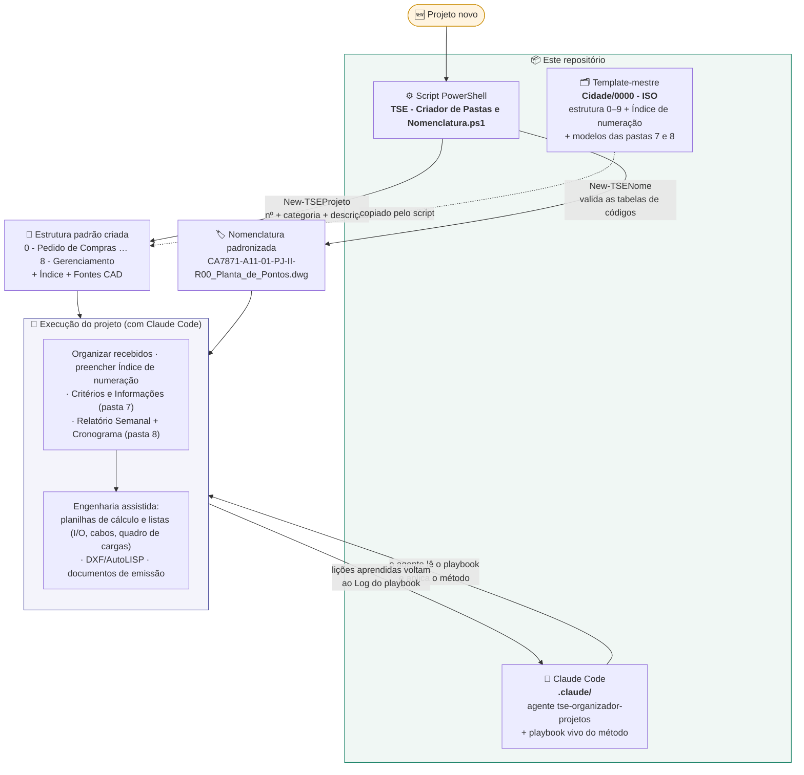

# TSE — Criador de Pastas e Nomenclatura

Script **PowerShell** que automatiza duas tarefas repetitivas no início de cada projeto de engenharia da **TSE Energia e Automação**:

1. **Cria a estrutura padrão de pastas** de um projeto novo (e copia os arquivos-modelo).
2. **Monta o nome do arquivo** seguindo o padrão de nomenclatura interno (`CLIENTE+PROJETO-ÁREA-NN-TIPO-CONTEÚDO-Rxx_Descrição.ext`).

Junto do script vem o **template-mestre** `Cidade\0000 - ISO\`, que contém a estrutura 0–9 vazia + o `Indice de detalhamento e numeração.xlsx` e o `TAMANHOS DE FONTES PARA CAD.jpeg` em branco.

---

## Como usar

No PowerShell, dentro da pasta onde está o `.ps1`:

```powershell
# 1) Menu interativo
.\"TSE - Criador de Pastas e Nomenclatura.ps1"

# 2) Só carregar as funções (dot-source) e chamar direto
. .\"TSE - Criador de Pastas e Nomenclatura.ps1"

New-TSEProjeto -Numero 8044 -Categoria PROJ -Descricao "TERMINAL PORTUARIO COFCO"

New-TSENome -Cliente CO -Projeto 8044 -Area A10 -Doc 1 `
            -Tipo MC -Conteudo SG -Rev 0 `
            -Descricao "Memorial de Calculo Guarda-Corpo" -Extensao docx
# -> CO8044-A10-01-MC-SG-R00_Memorial_de_Calculo_Guarda-Corpo.docx
```

Se o PowerShell bloquear a execução, rode uma vez:

```powershell
Set-ExecutionPolicy -Scope Process -ExecutionPolicy Bypass
```

---

## Antes do primeiro uso — configurar caminhos

No topo do `.ps1` há duas variáveis para ajustar à sua máquina:

```powershell
$RaizProjetos = "C:\...\Pasta-onde-os-projetos-serao-criados"
$PastaModelo  = "C:\...\Pasta-com-Indice.xlsx-e-Fontes-CAD.jpeg"
```

Sugestão: aponte `$PastaModelo` para a pasta `Cidade\0000 - ISO\` deste repositório.

---

## O que há neste repositório e como tudo se conecta



**Em resumo:** o script cria a casa e dá nome aos arquivos; o template garante que toda casa
nasce igual; e o agente + playbook fazem o Claude Code trabalhar do jeito TSE dentro dela —
aprendendo a cada projeto (o playbook é atualizado com as lições e versionado aqui).

<details>
<summary>Detalhe: menu do script PowerShell</summary>

```
MENU:  1) Criar estrutura de pastas  →  New-TSEProjeto  (nº, categoria, descrição → pastas 0–8 + modelos)
       2) Gerar nome de arquivo      →  New-TSENome     (cliente, projeto, área, doc, tipo, conteúdo, rev → nome validado)
       3) Ver tabelas de códigos     →  Show-TSETabela  (CLIENTE / AREA / TIPO / CONTEUDO)
       0) Sair
```
</details>

---

## Padrão de nomenclatura

```
CLIENTE + PROJETO - AREA - NN - TIPO - CONTEUDO - Rxx _ Descrição . ext
   CA      7871     A11   01    PJ      II        R00   Planta_de_Pontos  dwg
```

Campos:

| Campo     | Exemplo | Origem                                        |
|-----------|---------|-----------------------------------------------|
| Cliente   | `CA`    | Tabela `$CLIENTE` (2 letras)                  |
| Projeto   | `7871`  | Nº interno TSE                                |
| Área      | `A11`   | Tabela `$AREA` (`Axx`)                        |
| Doc       | `01`    | Nº do documento dentro da área (2 dígitos)    |
| Tipo      | `PJ`    | Tabela `$TIPO` (2 letras)                     |
| Conteúdo  | `II`    | Tabela `$CONTEUDO` (2 letras)                 |
| Revisão   | `R00`   | `R` + 2 dígitos (0 = emissão inicial)         |
| Descrição | texto   | Espaços viram `_`                             |
| Extensão  | `dwg`   | docx / pdf / dwg / xlsx ... (opcional)        |

As tabelas de códigos vivem dentro do próprio `.ps1` e podem ser editadas — basta acrescentar novas linhas nos hashtables `$CLIENTE`, `$AREA`, `$TIPO`, `$CONTEUDO`.

---

## Estrutura de pastas criada

```
NÚMERO - CATEGORIA DESCRIÇÃO\
├── 0 - Pedido de Compras
├── 1 - Recebidos
├── 2 - Fotos
├── 3 - ART
├── 4 - Editáveis
├── 5 - Vínculos
├── 6 - PDF's
├── 7 - Informações do Projeto
├── 8 - Gerenciamento do Projeto
├── Indice de detalhamento e numeração.xlsx
└── TAMANHOS DE FONTES PARA CAD.jpeg
```

O template-mestre em `Cidade\0000 - ISO\` traz também a subpasta `9 - Boletim de Medição` e a estrutura `8 - Gerenciamento do Projeto\Semanal\` com o `XXXX-Relatório Semanal-S00.xlsx` em branco.

---

## Onde isso se encaixa — o método TSE (em evolução)

Este script é o **passo 1** de um método maior de organização e execução de projetos de
elétrica/automação da TSE. A partir da estrutura de pastas + nomenclatura padronizadas, o
fluxo vem sendo ampliado com apoio de IA (Claude Code):

- **Organização de projeto** — entender escopo → estrutura de pastas → organizar recebidos →
  índice/numeração → preencher as planilhas de critérios e o relatório semanal.
- **Força & Instrumentação** — geração assistida das planilhas de cálculo e listas
  (quadro de cargas, dimensionamento de cabo/eletroduto por NBR, lista de cabos DE→PARA,
  lista de I/O), memoriais, e desenhos (leitura/geração de **DXF**, rotinas **AutoLISP**).
- **Arquitetura "cérebro + mão"** — o Claude atua como *cérebro* (lê P&ID/planilhas, calcula,
  cruza tag × carga × cabo × I-O e gera as tabelas de dados/posições) e o AutoCAD/AutoLISP como
  *mão* (insere os blocos da biblioteca com atributos, auto-numera, desenha). A troca de dados é
  por DXF / XLSX / LSP / DOCX.
- **Interoperabilidade com o ProElétrica** — nos projetos de força, o plugin ProElétrica
  (Multiplus) lança a fiação, e a inteligência elétrica fica gravada **dentro do próprio DWG**.
  Regra adotada: o ProElétrica insere os blocos inteligentes; o Claude prepara dados, cálculos e
  listas e faz leitura/análise — **sem reescrever** o DWG do plugin.

> **Repositório privado do grupo:** o playbook vivo do método
> (`.claude/tse-playbook-organizacao.md`) e o agente de organização de projetos
> (`.claude/agents/tse-organizador-projetos.md`) estão versionados aqui. O playbook é
> **autoaprendente** — cada projeto executado com o Claude Code acrescenta lições ao
> "Log de aprendizado"; mantenha-o atualizado ao trabalhar.

---

## Licença

[MIT](LICENSE).
